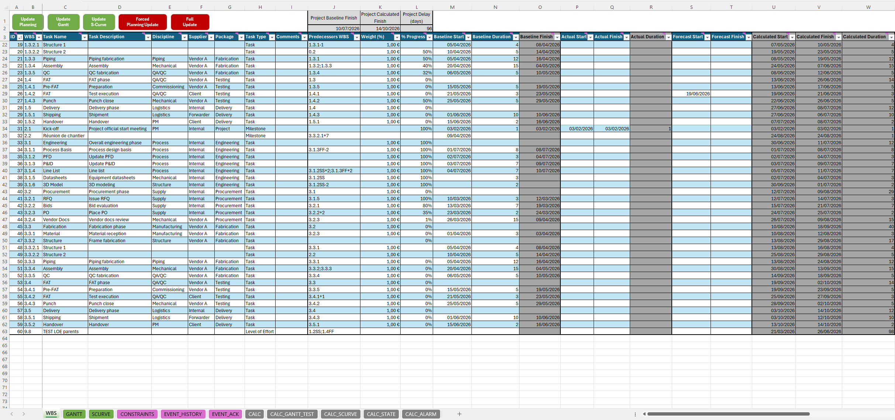
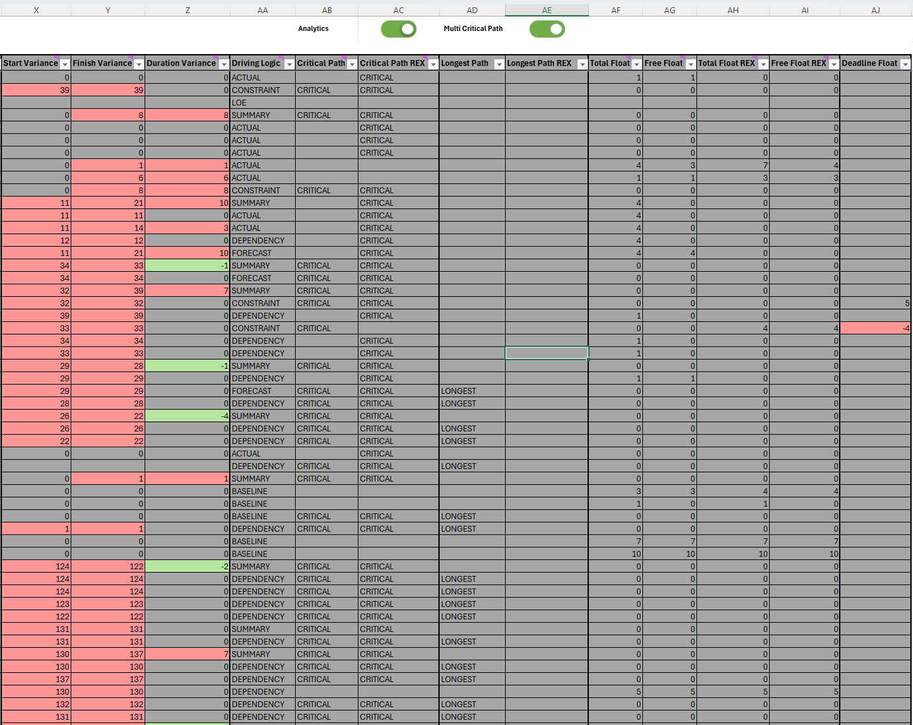
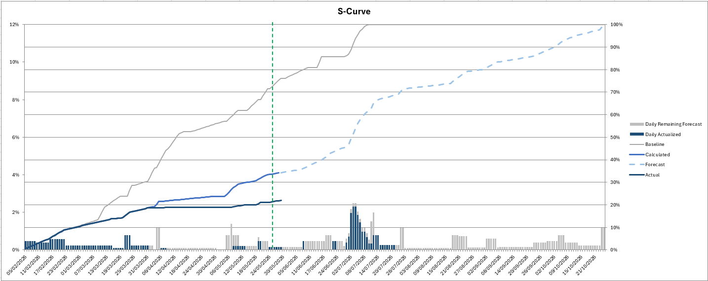
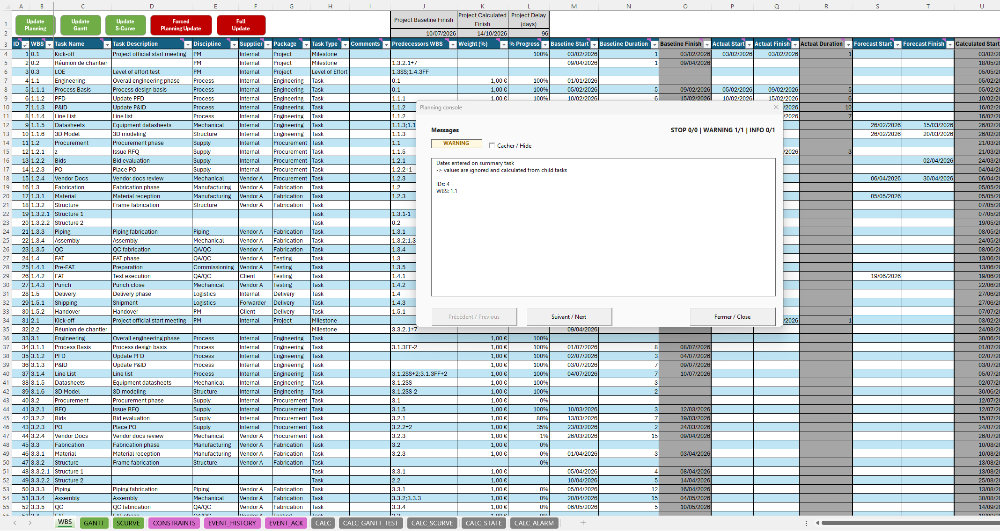

# ProjectEngine
Excel-native dependency-driven planning engine focused on transparency, simulation, diagnostics, and project controls workflows.

Open-source Excel/VBA project planning engine for dependency-driven schedule calculation, scenario analysis, and project controls reporting.

ProjectEngine turns an Excel workbook into a lightweight planning engine with native VBA scheduling logic, Gantt rendering, S-curve analytics, constraints, floats, and runtime diagnostics.

## Screenshots

### WBS Inputs

### Planning Analytics

### S-Curve

### Runtime Diagnostics

## Features

- Dependency-driven scheduling with FS / SS / FF relationships and lag support

- Baseline / Forecast / Actual planning logic

- Incremental recalculation with forced full recalculation option

- Critical Path, Total Float, Free Float, and Longest Path analytics

- Multi-network / multi-project criticality mode

- Hard constraints engine with dedicated constraint table

- Soft Deadline analytics with Deadline Float and warnings

- Gantt chart generation with timeline, links, milestones, constraints, and analytics overlays

- Live / Test planning simulation without committing changes

- Scenario workflow with fork-to-new-planning capability

- S-curve data generation and analytics

- Runtime console with INFO / WARNING / STOP severities

- Event History and Alarm History tables for audit/debug

- Warning hide/acknowledge system based on stable event signatures

- WBS input validation and guarded system writes to calculated columns

## Architecture

The project is structured around a VBA scheduling core and separate projection layers:

- `WBS` is the user-facing planning input and output table.

- `CALC` is the runtime calculation layer.

- `CONSTRAINTS` stores hard constraints and deadlines.

- `GANTT` is a visual projection of the calculated schedule.

- `EVENT\_HISTORY`, `CALC\_ALARM`, and `EVENT\_ACK` provide runtime diagnostics and warning management.

The Gantt and reporting layers do not drive the schedule calculation. They consume calculated outputs from the planning engine.

## Status

Active development — alpha.

The engine is functional and under continuous hardening. APIs, workbook structure, and VBA module organization may still evolve.

## License

GPL v3

