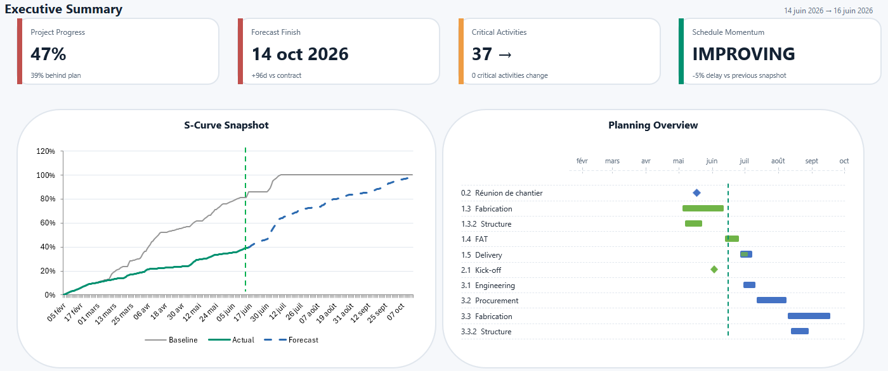
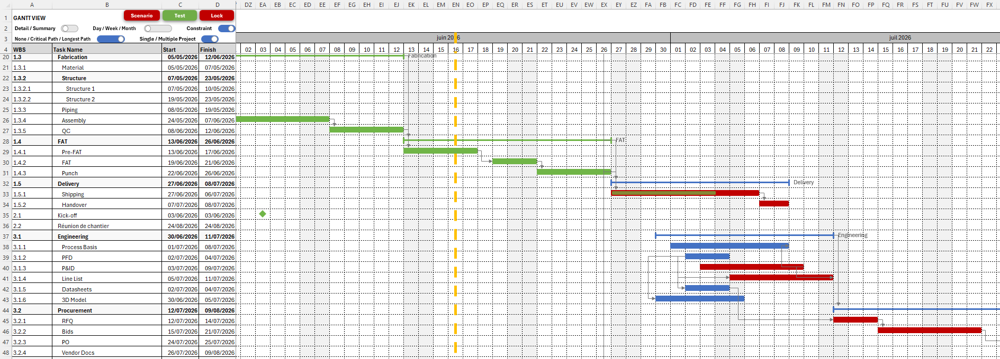
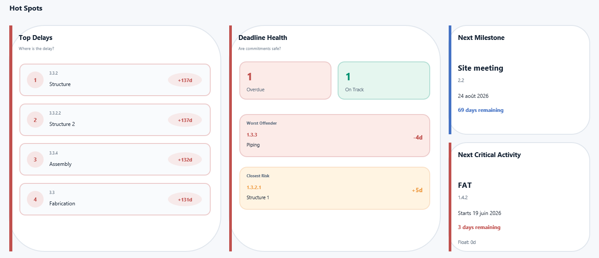
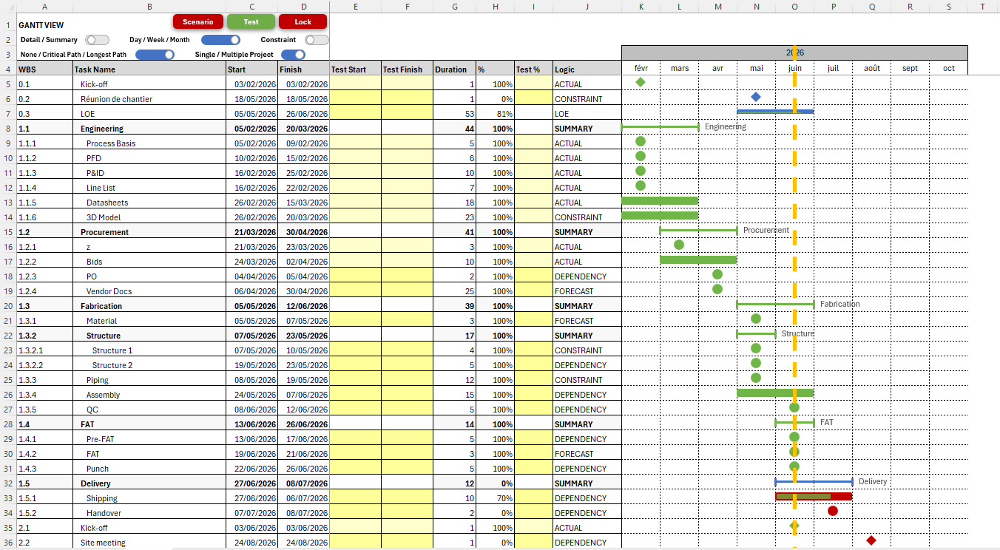

<div align="center">

# ProjectEngine

## Real scheduling. Native Excel.

**An open-source, dependency-driven scheduling and project controls engine for Microsoft Excel.**

[](https://github.com/TMailletFR/ProjectEngine/releases/latest)
[](LICENSE)
[](https://github.com/TMailletFR/ProjectEngine/stargazers)
[](https://github.com/TMailletFR/ProjectEngine/issues)

[**Download the latest release**](https://github.com/TMailletFR/ProjectEngine/releases/latest) ·
[**English documentation**](Docs/en/README.md) ·
[**Documentation française**](Docs/fr/README.md) ·
[**Report an issue**](https://github.com/TMailletFR/ProjectEngine/issues/new)

<br>



</div>

---

## A Gantt chart should calculate the schedule — not just draw it

Most Excel Gantt templates are static timelines.

They can display dates and colored bars, but they do not understand the logic connecting activities. When one task slips, successors must be checked manually. Critical activities can change without warning. Floats, deadlines, progress curves and reporting can quietly become inconsistent.

**ProjectEngine turns the workbook into a real scheduling system.**

Define the WBS, dates, progress, calendars, constraints and dependencies. ProjectEngine calculates the network, propagates changes, identifies the Critical and Longest Paths, measures float, surfaces planning risks and keeps the Gantt, analytics, Dashboard and S-Curve aligned.

All inside the Excel environment your organization already uses.

---

## What happens when one activity slips?

| Static Excel Gantt | ProjectEngine |
| --- | --- |
| Successor dates are reviewed manually | Dependency logic propagates the change |
| Critical activities may be missed | Critical and Longest Paths are recalculated |
| Float is absent or maintained separately | Total and Free Float are recalculated |
| Conflicts can remain hidden | Structured `INFO`, `WARNING` and `STOP` diagnostics identify them |
| Reporting can drift away from the schedule | Gantt, analytics, Dashboard and S-Curve consume the same calculated planning data |
| Alternatives require duplicated workbooks | TEST and SCENARIO workflows evaluate changes before they are applied |

> **Most Excel Gantt templates draw schedules. ProjectEngine calculates them.**

---

## Built for complex project environments

ProjectEngine is designed for people who need a dependable planning model, not a decorative timeline:

- planning engineers and schedulers;
- project controls and PMO teams;
- project managers working primarily in Excel;
- engineering, EPC, construction and infrastructure projects;
- shipbuilding, manufacturing and industrial programmes;
- teams familiar with Microsoft Project or Primavera P6 but working without access to those licenses;
- organizations where Excel is available everywhere but additional software is not.

ProjectEngine can also distinguish criticality across multiple projects in the same workbook, supporting programme-level analysis rather than treating every activity as part of one undifferentiated schedule.

### Where it fits

ProjectEngine does **not** claim to replace every capability of Microsoft Project, Primavera P6 or a full enterprise project management suite.

It fills a different gap:

> **Professional dependency-driven scheduling for teams that need to remain in Excel.**

---

## See the planning system

### Interactive, dependency-driven Gantt



Activities, summaries, milestones, Level of Effort tasks, constraints, dependencies, progress and critical-path overlays remain connected to the same scheduling model.

### Planning analytics


Review Critical and Longest Paths, Total and Free Float, Driving Logic, deadline exposure, schedule variance and multi-project criticality from a dedicated analysis layer.

### S-Curve and workload distribution


Compare Baseline, Actual, Forecast and Calculated progress while viewing the time-phased workload behind the curves.

<details>
<summary><strong>More screenshots</strong></summary>

### Hot Spots analysis



### Month-scale Gantt



### Diagnostic console


### WBS planning inputs


</details>

---

## Core capabilities

<table>
<tr>
<td width="50%" valign="top">

### Scheduling engine

- dependency-driven scheduling;
- FS, SS and FF relationships;
- positive and negative lags;
- multiple predecessors;
- automatic schedule propagation;
- 5-day and 6-day working calendars;
- milestones and Level of Effort activities;
- parent / child date rollups;
- cycle and missing-predecessor detection;
- hard constraints and deadlines.

</td>
<td width="50%" valign="top">

### Schedule intelligence

- Critical Path analysis;
- Longest Path analysis;
- Total Float and Free Float;
- Driving Logic;
- baseline and forecast variance;
- deadline float and deadline monitoring;
- delay and momentum analysis;
- parent-date and task-type warnings;
- multi-project criticality analysis.

</td>
</tr>
<tr>
<td width="50%" valign="top">

### Controlled simulation

- focused, non-destructive TEST mode;
- complete SCENARIO alternatives;
- LOCK workflow for applying validated results;
- drag-and-resize simulation from the Gantt;
- Day, Week and Month snapping;
- predictive rendering;
- transactional execution and controlled rollback.

</td>
<td width="50%" valign="top">

### Reporting and diagnostics

- Day, Week and Month Gantt views;
- executive Dashboard;
- planning Hot Spots;
- Baseline, Actual, Forecast and Calculated S-Curves;
- workload distribution;
- structured `INFO`, `WARNING` and `STOP` messages;
- Event History and Alarm History;
- warning acknowledgement and message navigation.

</td>
</tr>
</table>

<details>
<summary><strong>View the complete feature set</strong></summary>

### Planning logic

- Baseline, Actual, Forecast and Calculated planning;
- single-source dependency-driven calculation;
- signature-based incremental recalculation;
- forced full recalculation when required;
- full and partial output synchronization;
- protected calculated-column lifecycle;
- canonical task identity and parsed-network contracts.

### Constraints and controls

- dedicated constraints table;
- hard-constraint calculation;
- deadline management;
- constraint-impact analysis;
- grouped dependency, constraint, cascade and upstream diagnostics;
- bilingual planning messages;
- stable event signatures;
- acknowledgement workflow.

### Visualization

- tasks, summaries, milestones and Level of Effort rendering;
- dependency links;
- progress, critical-path and longest-path overlays;
- constraints, deadlines and Today Line;
- fractional positioning in Week and Month scales;
- predictive Shape Registry;
- deterministic fallback and lazy geometry repair;
- independently refreshable Gantt, Dashboard and S-Curve outputs.

### Workbook lifecycle and safety

- Planning Reset for project turnover;
- Full Reset for complete workbook cleanup;
- Safe Empty State for Gantt and S-Curve;
- guarded WBS write scopes;
- owner-controlled output writers;
- transactional simulation workflows;
- isolated validation on temporary workbook copies;
- deterministic regression harnesses;
- no competing calculation engines across planning, simulation or reporting.

</details>

---

## Get started

1. Go to the [latest release](https://github.com/TMailletFR/ProjectEngine/releases/latest).
2. Download the `ProjectEngine_*.xlsm` workbook from **Assets**.
3. Open it in Microsoft Excel and enable the workbook's macros.
4. Use the integrated Quick Start guide on the WBS sheet.
5. Enter activities, hierarchy, dates, progress and dependencies.
6. Run **Planning Update** to calculate and publish the schedule.
7. Review diagnostics, then explore the Gantt, analytics, Dashboard and S-Curve.

The WBS onboarding is available in **English and French** and includes:

- Required / Optional / Calculated field indicators;
- contextual help for every input column;
- an integrated Quick Start guide;
- automatic localization when the workbook language changes.

> Download the prepared `.xlsm` asset from the release page.  
> The automatically generated “Source code” archives do not contain a ready-to-use Excel workbook.

---

## Typical planning workflow

```text
WBS inputs
   ↓
Planning Update
   ↓
Dependency network + calendars + constraints
   ↓
Calculated dates + rollups + schedule analytics
   ↓
Diagnostics
   ↓
Gantt · Dashboard · S-Curve · Planning Analytics
   ↓
TEST / SCENARIO simulation
   ↓
Review and LOCK validated changes
```

1. Build the WBS and define task types, calendars, dates, progress and dependencies.
2. Add hard constraints or deadlines when required.
3. Run Planning Update.
4. Resolve any blocking `STOP` diagnostics and review `WARNING` or `INFO` messages.
5. Analyze Critical and Longest Paths, float, Driving Logic, deadlines and project health.
6. Evaluate focused changes in TEST mode or create a complete SCENARIO.
7. Review predictive differences before applying validated results with LOCK.
8. Refresh the reporting view needed for the next planning or management review.

---

## Why the results remain consistent

ProjectEngine is not a collection of disconnected worksheet macros.

The scheduling engine is the **single source of truth**. Simulation, diagnostics, visualization and reporting reuse its outputs rather than implementing their own competing date logic.

| Domain | Responsibility |
| --- | --- |
| Runtime workflow | Macro lifecycle, nesting, controlled abort and deferred display |
| WBS / DataSync | User inputs and synchronization into canonical calculation tables |
| Core calculation | Network logic, calendars, constraints, activity dates, LOE and rollups |
| Analytics | Critical / Longest Path, float, deadlines, variance and schedule health |
| Output writers | Controlled full or partial publication to protected workbook outputs |
| Gantt | Timeline refresh, rendering, geometry, interaction and drag simulation |
| Simulation | TEST, SCENARIO and LOCK services using the existing Core |
| Dashboard / S-Curve | Executive reporting and time-phased progress analytics |
| Diagnostics | Message preparation, console policy, history, alarms and acknowledgement |
| Canonical contracts | Shared identity, parsed network and incremental-calculation contracts |

This separation makes the workbook easier to validate, maintain and extend without weakening the determinism of the planning model.

For the full technical design:

- [English architecture and maintenance documentation](Docs/en/README.md)
- [Documentation française — architecture et maintenance](Docs/fr/README.md)

---

## Project status

**Stable.**

ProjectEngine reached its first stable baseline with v1.0.0. The scheduling engine, simulation workflows, diagnostics, Gantt rendering, analytics, Dashboard, S-Curve, localization, reset workflows and guarded workbook lifecycle are operational and protected by permanent validation harnesses.

The project remains actively maintained. Future development is driven by real planning use cases, reported issues and community feedback.

- [Latest release](https://github.com/TMailletFR/ProjectEngine/releases/latest)
- [All releases](https://github.com/TMailletFR/ProjectEngine/releases)
- [Open issues](https://github.com/TMailletFR/ProjectEngine/issues)
- [Start a discussion](https://github.com/TMailletFR/ProjectEngine/discussions)

---

## Feedback shapes the roadmap

The original feature backlog has reached a mature state. The next useful improvements should come from planners, project controls professionals and teams using ProjectEngine on schedules the project has not encountered yet.

Useful contributions include:

- a planning workflow that is difficult to represent;
- a missing relationship, calendar or reporting need;
- an unexpected result on a real schedule;
- an onboarding point that was unclear;
- a performance issue on a large programme;
- a feature you rely on in Microsoft Project or Primavera P6 but miss in Excel.

Use [GitHub Issues](https://github.com/TMailletFR/ProjectEngine/issues) for reproducible problems and feature requests, or [GitHub Discussions](https://github.com/TMailletFR/ProjectEngine/discussions) for broader planning questions and ideas.

When reporting an issue, remove confidential or company-specific data before sharing any workbook or screenshot.

---

## Frequently asked questions

<details>
<summary><strong>Is ProjectEngine just another Excel Gantt template?</strong></summary>

No. A template mainly visualizes dates. ProjectEngine calculates a dependency network, propagates schedule changes, analyzes path and float, manages constraints, supports simulations and keeps its reporting layers aligned with calculated planning outputs.

</details>

<details>
<summary><strong>Does ProjectEngine replace Microsoft Project or Primavera P6?</strong></summary>

Not in every use case, and it does not claim to. Dedicated scheduling platforms cover broader enterprise, resource and portfolio requirements. ProjectEngine is designed for teams that need genuine scheduling capabilities while remaining inside Excel.

</details>

<details>
<summary><strong>Do users need to know VBA?</strong></summary>

No. The released workbook is intended to be used through its Excel sheets, controls and integrated onboarding. VBA knowledge is only relevant for people who want to inspect, maintain or extend the source.

</details>

<details>
<summary><strong>Can it manage more than one project?</strong></summary>

Yes. ProjectEngine includes multi-project criticality analysis so a programme can distinguish project-level criticality instead of treating every activity as one single project network.

</details>

<details>
<summary><strong>Can I test a delay without changing the live WBS?</strong></summary>

Yes. TEST mode supports focused non-destructive changes, while SCENARIO mode supports complete schedule alternatives. Validated simulation results can be applied through the controlled LOCK workflow.

</details>

<details>
<summary><strong>Which languages are supported?</strong></summary>

The workbook onboarding and planning messages support English and French, with global and per-module localization controls.

</details>

<details>
<summary><strong>Where should I download ProjectEngine?</strong></summary>

Use the prepared `.xlsm` workbook attached to the [latest GitHub release](https://github.com/TMailletFR/ProjectEngine/releases/latest). Do not use GitHub's automatically generated source archives when you want the ready-to-run workbook.

</details>

---

## Contributing

ProjectEngine welcomes:

- bug reports with clear reproduction steps;
- feature requests grounded in a real planning need;
- usability and documentation feedback;
- anonymized test cases;
- code contributions that preserve the single-source scheduling architecture and existing public workbook contracts.

Before proposing code changes, review the architecture and maintenance documentation:

- [English documentation](Docs/en/README.md)
- [Documentation française](Docs/fr/README.md)

For substantial changes, open an issue or discussion first so the planning rule, compatibility impact and validation strategy can be agreed before implementation.

---

## Support ProjectEngine

The most useful ways to support the project are:

1. **Star the repository** so more Excel and project-controls users can discover it.
2. **Share it** with a planner, scheduler or project manager who is maintaining a complex schedule manually.
3. **Report feedback** after testing it on a real, non-confidential planning case.
4. **Contribute** an issue, use case, documentation improvement or validated change.

If ProjectEngine saves you meaningful time and you would also like to support its continued development:

<div align="center">

</div>

---

## License

ProjectEngine is released under the [GNU General Public License v3.0](LICENSE).

You may use, study, modify and redistribute the project under the terms of that license. Derivative distributions must preserve the same license obligations.

---

<div align="center">

### Stop maintaining complex schedules by hand.

[**Download ProjectEngine**](https://github.com/TMailletFR/ProjectEngine/releases/latest) ·
[**Star the repository**](https://github.com/TMailletFR/ProjectEngine) ·
[**Read the documentation**](Docs/en/README.md)

**Real scheduling. Native Excel.**

</div>
